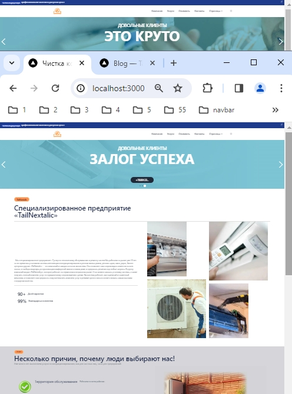

# TailNextalic

**TailNextalic** это бесплатный шаблон с открытым исходным кодом, позволяющий создать ваш веб-сайт с
использованием **[NextJS](https://nextjs.org/) + [Tailwind CSS](https://tailwindcss.com/)**. Готовый новый проект
разработан с учетом лучших практик.

## Features

- ✅ Интеграция с **Tailwind CSS** с поддержкой **Тёмного режима**.
- ✅ Оценки **готовности к производительности** в отчетах [Lighthouse](https://web.dev/measure/)
  и [PageSpeed ​​​​Insights](https://pagespeed.web.dev/).
- ✅ **Оптимизация изображений** и **Оптимизация шрифтов**.
- ✅ Быстрый и **SEO-дружественный блог**.
- ✅ Генерация **карты сайта** и **robots.txt** на основе ваших маршрутов.

---

  

---


---


<br>

## Некоторые применяемые библиотеки

```bash
https://www.npmjs.com/package/react-slick
npm install react-slick --save
# or
https://www.npmjs.com/package/slick-carousel
npm install slick-carousel
# or
https://www.npmjs.com/package/@emotion/styled
npm i @emotion/styled
# or
https://www.npmjs.com/package/markdown-it
npm install markdown-it --save
# or
https://www.npmjs.com/package/gray-matter
npm install --save gray-matter
# or
bun dev
```

<br>

## Demo

📌 [https://tailnext.vercel.app/](https://tailnext.vercel.app/)

<br>

## Запуск проекта

- Скопировать репозиторий
- Установить зависимости: `npm install`
- Запустите сервер разработки: `npm run dev`
- Просмотр проекта в локальной среде: `localhost:3000`

### Структура проекта

Внутри шаблона **TailNextalic** вы увидите следующие папки и файлы:

```
/
├── src/app/
│       ├── (blog)
│       │   ├── [slug]
|       |   |   └── page.js
|       |   └── blog
|       |       └── page.js
│       ├── company
|       |   └── page.js
│       ├── components
|       |   ├─── about
|       |   |    └── page.js
│       |   ├─── carousel
|       |   |    └── page.js
│       |   ├─── carousel
|       |   |    └── page.js
|       |   └── ...
│       ├── componentsT
|       |   ├─── atoms
|       |   ├─── widgets/
|       |   |    ├── Header.astro
|       |   |    ├── Footer.astro
|       |   |    └── ...
│       |   ├─── common
|       |   |    └── page.js
│       |   ├─── featuredC
|       |   |    └── page.js
|       |   └── ...
│       ├── atoms/
│       ├── contact
|       |   └── page.js
│       ├── pages
|       |   ├─── home
|       |   |    └── page.js
│       |   ├─── homeC
|       |   |    └── page.js
│       |   ├─── homeT
|       |   |    └── page.js
|       |   └── ...
│       ├── pricing
|       |   └── page.js
│       ├── services
|       |   └── page.js
│       ├── styles
|       |   └── page.css
│       ├── globals.css
│       ├── layout.js
│       └── page.js
├── public/
│   └── favicon.svg
├── src/
│   ├── assets/
│   ├── assetsT/
│   │   └── images/
│   ├── components/
│   │   ├── atoms/
|   |   └── widgets/
|   |       ├── Header.astro
|   |       ├── Footer.astro
|   |       └── ...
│   │── content/
│   |   └── blog/
│   |       ├── demo-post-1.md
│   |       └── ...
│   ├── shared/
│   |   └── data/
│   |       ├── global.data.tsx
│   |       └── ...
│   ├── stories/
│   ├── utils/
│   └── config.js
├── package.json
└── ...
```
